# 多线程


## 一.多线程概述

### process(进程)和thread(线程)

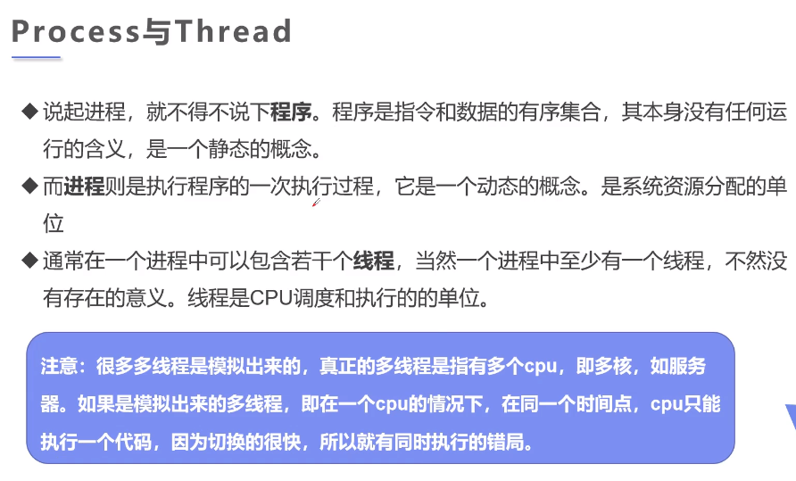

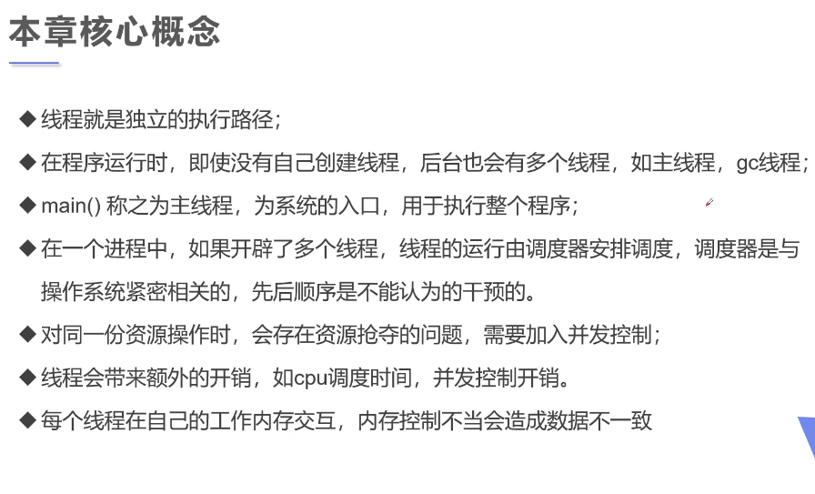

## 二.继承Thread类

### 1.demo1 入门

```java
public class TestThread1 extends Thread {
    @Override
    public void run() {
        for (int i = 0; i < 2000 ; i++) {
            System.out.println("我在敲代码---"+i);
        }
    }

    public static void main(String[] args) {
        TestThread1 testThread1 = new TestThread1();
        testThread1.start();
        for (int i = 0; i < 2000; i++) {
            System.out.println("我在学习多线程---"+i);
        }

    }
}
```

### 2.demo2网图下载

```java
import org.apache.commons.io.FileUtils;

import java.io.File;
import java.io.IOException;
import java.net.URL;

//联系下载网络图片
public class TestThread2 extends Thread {
  private String url;
  private String name;
  public TestThread2(String url,String name){
      this.url=url;
      this.name=name;
  }
  public void run(){
      WebDownload webDownload = new WebDownload();
      webDownload.downloader(url,name);
      System.out.println(name+"下载完成");
  }

    public static void main(String[] args) {
        TestThread2 testThread1 = new TestThread2("https://img.tupianzj.com/uploads/allimg/202002/9999/04774be122.jpg","1.jpg");
        TestThread2 testThread2 = new TestThread2("https://img.tupianzj.com/uploads/allimg/202002/9999/08b8d2520e.jpg","2.jpg");
        TestThread2 testThread3 = new TestThread2("https://img.tupianzj.com/uploads/allimg/202002/9999/23fb60ee23.jpg","3.jpg");
        testThread1.start();
        testThread2.start();
        testThread3.start();
    }


}
class WebDownload{
    public void downloader(String url,String name){
        try {
            FileUtils.copyURLToFile(new URL(url),new File(name));
        } catch (IOException e) {
            e.printStackTrace();
        }
    }
}

```

## 三.实现runnable接口

### 1.demo3 入门

```java
package dome1;
//创建线程方式2:实现runnable接口
public class TestThread3 implements Runnable {

    @Override
    public void run() {
        for (int i = 0; i < 2000 ; i++) {
            System.out.println("我在敲代码---"+i);
        }
    }

    public static void main(String[] args) {
        TestThread3 testThread3 = new TestThread3();
        Thread thread = new Thread(testThread3);
        thread.start();

        for (int i = 0; i < 2000; i++) {
            System.out.println("我在学习多线程---"+i);
        }

    }
}

```

### 2.demo4认识并发问题

```java
package dome1;

//多个线程同时操作同一个对象
//多个线程操作同一个资源的情况下数据不安全
public class TestThread4 implements  Runnable{

    private   int ticketNum = 10;
    //
    @Override
    public  void run() {
        while (true){
            if(ticketNum<=0)break;
            System.out.println(Thread.currentThread().getName()+"--拿到了--"+ticketNum--);
            try {
                Thread.sleep(100);
            } catch (InterruptedException e) {
                e.printStackTrace();
            }
        }
    }

     public static void main(String[] args) {
         TestThread4 testThread4 = new TestThread4();

         new Thread(testThread4,"bin").start();
         new Thread(testThread4,"飞鸿").start();
         new Thread(testThread4,"敏敏").start();
     }
}

```

3.龟兔赛跑 Race

```
package dome1;

public class Race implements Runnable {
    private String winner;

    @Override
    public void run() {
        for (int i = 1; i <= 100 ; i++) {
            if(Thread.currentThread().getName().equals("兔子")){//如果是兔子
                if(i%10==0){//如果是10 则线程休息下
                    try {
                        Thread.sleep(5);
                    } catch (InterruptedException e) {
                        e.printStackTrace();
                    }
                }else i++;//否则多走一步 即两倍的速度
            }

            System.out.println(Thread.currentThread().getName()+"跑了"+i+"米");
            Boolean win = win(i);
            if (win)break;
        }
    }

    public Boolean win(int length){
        if(length >= 100){
            winner = Thread.currentThread().getName();
            System.out.println(winner+"是胜利者");
            return true;
        }else if(winner !=null )return true;//如果存在胜利者则返回true
        else return false;
    }

    public static void main(String[] args) {
        Race race = new Race();
        new Thread(race,"兔子").start();
        new Thread(race,"乌龟").start();
    }
}

```

## 四.了解callable实现多线程

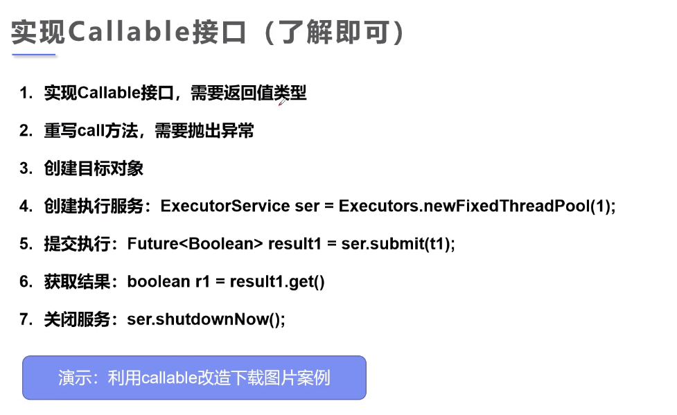


```java
package demo02;

import org.apache.commons.io.FileUtils;

import java.io.File;
import java.io.IOException;
import java.net.URL;
import java.util.concurrent.*;

public class TestCallable implements Callable<Boolean> {


    private String url;
    private String name;

    public TestCallable(String url, String name) {
        this.url = url;
        this.name = name;
    }

    @Override
    public Boolean call() throws Exception {
        WebDownload webDownload = new WebDownload();
        webDownload.downloader(url,name);
        System.out.println(name+"下载完成");
        return true;
    }

    public static void main(String[] args) throws ExecutionException, InterruptedException {
        TestCallable testThread1 = new TestCallable("https://img.tupianzj.com/uploads/allimg/202002/9999/04774be122.jpg","11.jpg");
        TestCallable testThread2 = new TestCallable("https://img.tupianzj.com/uploads/allimg/202002/9999/08b8d2520e.jpg","21.jpg");
        TestCallable testThread3 = new TestCallable("https://img.tupianzj.com/uploads/allimg/202002/9999/23fb60ee23.jpg","31.jpg");
        //创建线程池
        ExecutorService service = Executors.newFixedThreadPool(3);
        //提交执行
        Future<Boolean> result1 = service.submit(testThread1);
        Future<Boolean> result2 = service.submit(testThread2);
        Future<Boolean> result3 = service.submit(testThread3);
        //获取结果
        Boolean flag1 = result1.get();
        Boolean flag2 = result2.get();
        Boolean flag3 = result3.get();
        System.out.println("result1:"+flag1);
        System.out.println("result2:"+flag2);
        System.out.println("result3:"+flag3);
        //关闭服务
        service.shutdownNow();

    }


}
class WebDownload{
    public void downloader(String url,String name){
        try {
            FileUtils.copyURLToFile(new URL(url),new File(name));
        } catch (IOException e) {
            e.printStackTrace();
        }
    }
}
```

## 五.静态代理和Thread

Thread的本质是使用了静态代理,下面用一段静态代理模拟一下thread

```

//代理实现接口
interface Marry{
    void marry();
}
//代理类
class StaticProxy implements Marry {
    private Marry marry;

    public StaticProxy() {
    }

    public StaticProxy(staticProxy.Marry marry) {
        this.marry = marry;
    }


    @Override
    public void marry() {
        before();
        this.marry.marry();
        after();
    }

    private void before(){
        System.out.println("准备结婚了");
    }

    private void after(){
        System.out.println("精疲力竭了");
    }

    public static void main(String[] args) {

//        Person person = new Person();
//        StaticProxy staticProxy = new StaticProxy(person);
//        staticProxy.marry();

        //精简一下对比 静态代理和线程
        new StaticProxy(new Person()).marry();

        new Thread(()-> System.out.println("我爱你")).start();
    }
}

//真实角色
class Person implements Marry{
    @Override
    public void marry() {
        System.out.println("飞鸿今天要结婚了");
    }
}

```

## 六.lambda表达式

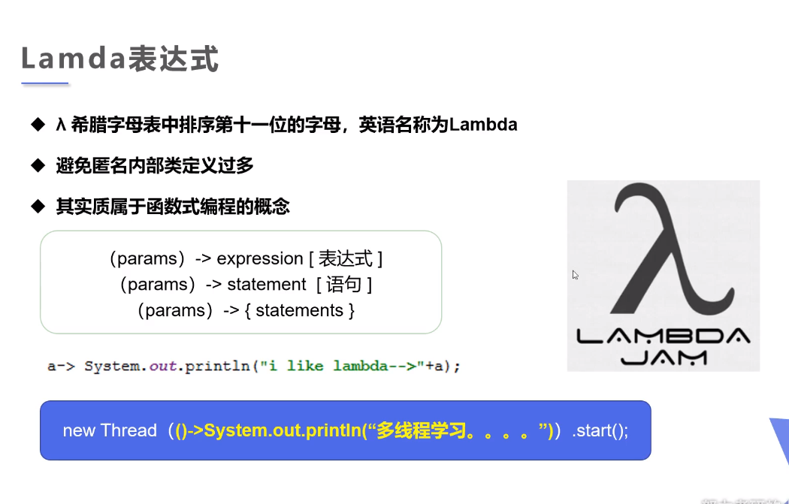

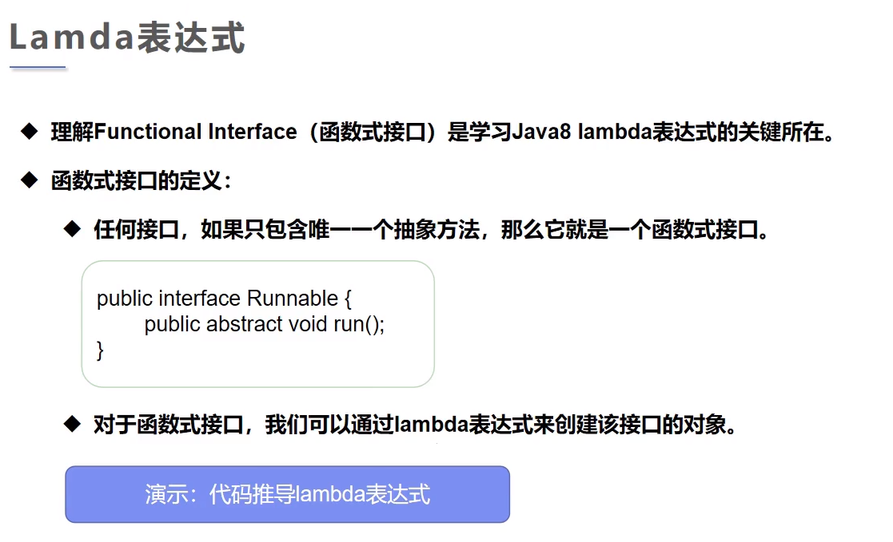

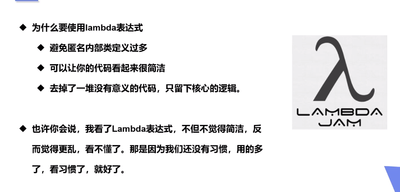

```java

//1定义一个接口
interface ILook{
    void lambda();
}
//2实现类
class Look implements ILook{

    @Override
    public void lambda() {
        System.out.println("我是ILook");
    }
}

public class TestLambda1 {

    //3.静态内部类
    static class Look2 implements ILook{
        @Override
        public void lambda() {
            System.out.println("我是ILook2");
        }
    }


    public static void main(String[] args) {
        Look look = new Look();
        look.lambda();
        Look2 look2 = new Look2();
        look2.lambda();

        //4.局部内部类
        class Look3 implements  ILook{
            @Override
            public void lambda() {
                System.out.println("我是ILook3");
            }
        }

        Look3 like3 = new Look3();
        like3.lambda();

        //5.匿名内部类
        ILook look4 =new ILook(){
            @Override
            public void lambda() {
                System.out.println("我是Ilook4");
            }
        };
        look4.lambda();

        //6用lambda
        ILook look5 = ()->{
            System.out.println("我是Ilook5");
        };

        look5.lambda();

    }

}
```

```java
package lambda;


interface ILove {
    void love(int a);
}

class Love1 implements ILove {

    @Override
    public void love(int a) {
        System.out.println("love" + a);
    }
}

public class TestLambda2 {

    public static void main(String[] args) {
        ILove love1 = new Love1();
        love1.love(1);

        //1 lambda表达式简化
        ILove love2 = (int a) -> {
            System.out.println("love" + a);
        };
        //2 lambda表达式简化 去掉参数类型  多个参数的话可以都省略 一般情况下使用这个比较好
        ILove love3 = (a) -> {
            System.out.println("love" + a);
        };
        //3 lambda表达式简化 去掉参数括号 但是仅限一个参数
        ILove love4 = a -> {
            System.out.println("love" + a);
        };
        //4. lambda表达式简化 去掉花括号 但是只能有一行代码的情况下才行
        ILove love5 = a -> System.out.println("love" + a);


        love2.love(2);
        love3.love(3);
        love4.love(4);
        love5.love(5);

       
    }

}

```

## 七.线程的状态

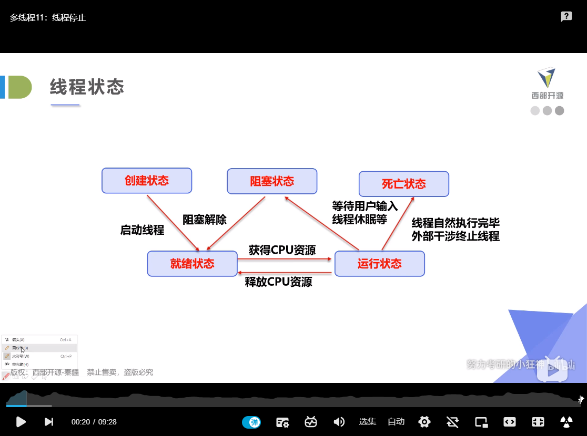


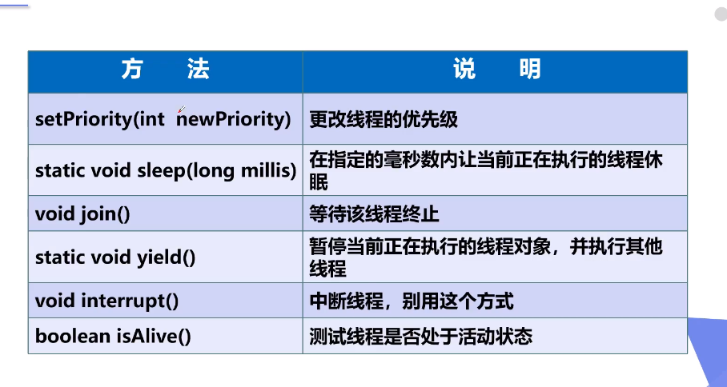

### 1.线程停止 

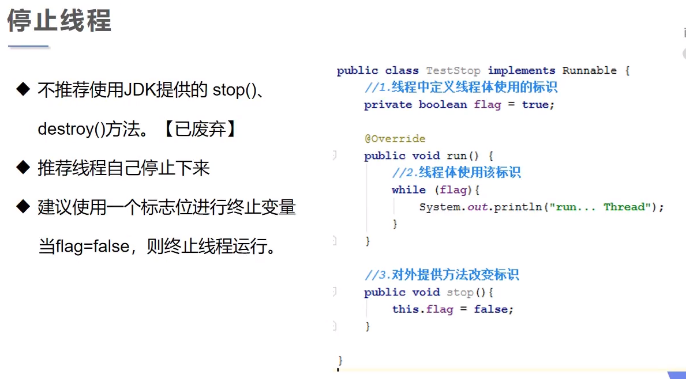


```java

//测试stop
//1.建议线程正常停止-->利用次数,不建议死循环
//2.建议使用标志位-->设置一个标志位
//.不要使用stop或则destroy等过时的方法
public class TestStop implements Runnable{
    private Boolean flag = true;

    @Override
    public void run() {
        int i = 0;
        while (flag){
            System.out.println("线程正在跑"+i++);
        }
    }

    public void stop(){
        this.flag= false;
        System.out.println("线程终止");
    }

    public static void main(String[] args) {
        TestStop testStop = new TestStop();
        new Thread(testStop).start();
        for (int i = 0; i < 1000; i++) {
            System.out.println("主线程正在跑"+i);
            if(i==900){
                testStop.stop();
            }
        }
    }
}
```

### 2.线程休眠

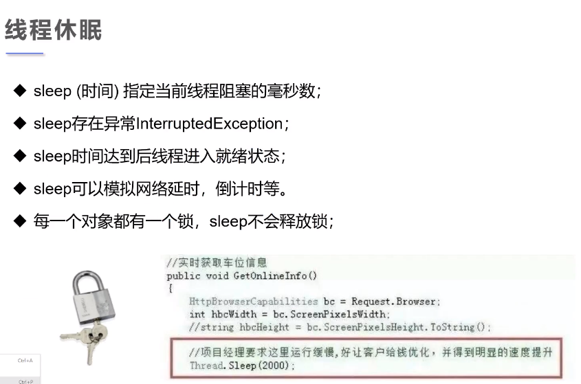

```java
public class TestSleep2 {
    //倒计时
    public static void tenDown() throws InterruptedException {
        int num =10;
        while(true){
            Thread.sleep(1000);
            System.out.println(num--);
            if(num <= 0){
                break;
            }
        }
    }

    public static void main(String[] args) throws InterruptedException {
        tenDown();

        //模拟时钟
        LocalTime localTime = LocalTime.now();
        while (true){
            DateTimeFormatter dateTimeFormatter = DateTimeFormatter.ofPattern("HH:mm:ss");
            String format = localTime.format(dateTimeFormatter);
            Thread.sleep(1000);
            System.out.println(format);
            localTime = LocalTime.now();
        }
    }
}
```

### 3.线程礼让

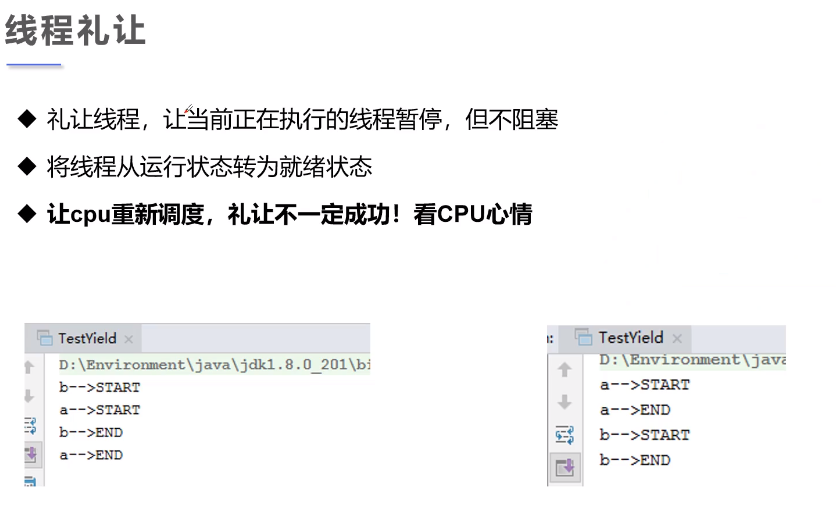

```java

public class TestJoin implements  Runnable{
    @Override
    public void run() {
        for (int i = 0; i < 100 ; i++) {
            System.out.println("线程来了"+i);
        }
    }

    public static void main(String[] args) throws InterruptedException {

        TestJoin testJoin = new TestJoin();
        Thread thread = new Thread(testJoin);
        thread.start();

        for (int i = 0; i < 1000 ; i++) {
            if(i==200){
                thread.join();//插队
            }
            System.out.println("main"+i);
        }
    }
}

```

### 4.线程强制执行

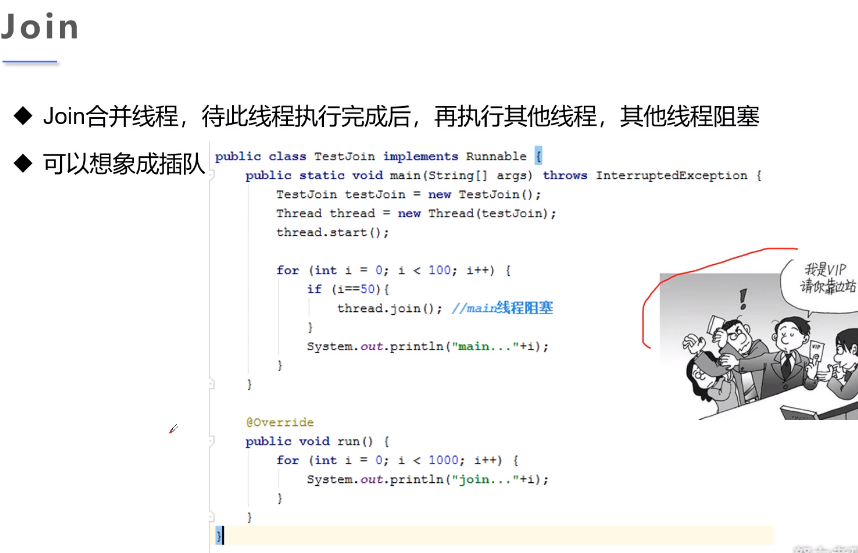

```java


public class TestJoin implements  Runnable{
    @Override
    public void run() {
        for (int i = 0; i < 100 ; i++) {
            System.out.println("线程来了"+i);
        }
    }

    public static void main(String[] args) throws InterruptedException {

        TestJoin testJoin = new TestJoin();
        Thread thread = new Thread(testJoin);
        thread.start();

        for (int i = 0; i < 1000 ; i++) {
            if(i==200){
                thread.join();//插队
            }
            System.out.println("main"+i);
        }
    }
}

```

### 5.线程状态观测

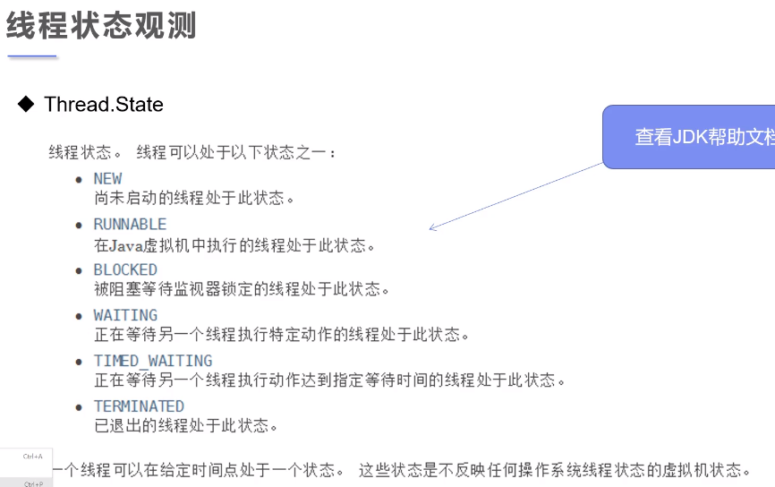

```java

public class TestState  {
    public static void main(String[] args) throws InterruptedException {

        Thread thread = new Thread(() -> {
            for (int i = 0; i < 5; i++) {
                try {
                    Thread.sleep(1000);
                } catch (InterruptedException e) {
                    e.printStackTrace();
                }
            }
        });

        //观察状态
        Thread.State state = thread.getState();
        System.out.println(state);

        //观察启动后
        thread.start();
        state = thread.getState();
        System.out.println(state);

        while(state != Thread.State.TERMINATED){
            Thread.sleep(200);
            state = thread.getState();
            System.out.println(state);
        }
    }

}

```

### 6.线程优先级

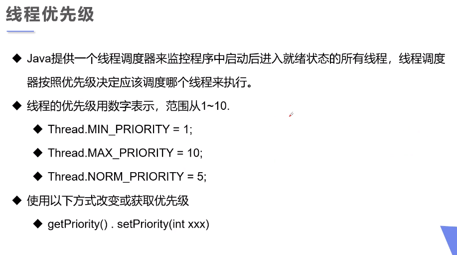

```java

public class TestPriority implements Runnable {
    @Override
    public void run() {
        System.out.println(Thread.currentThread().getName()+"--->"+Thread.currentThread().getPriority());
    }

    public static void main(String[] args) {
        TestPriority testPriority = new TestPriority();
        Thread thread1 = new Thread(testPriority);
        Thread thread2 = new Thread(testPriority);
        Thread thread3 = new Thread(testPriority);
        Thread thread4 = new Thread(testPriority);
        Thread thread5 = new Thread(testPriority);
        Thread thread6 = new Thread(testPriority);

        thread1.start();

        thread2.setPriority(1);
        thread3.setPriority(4);
        thread4.setPriority(7);
        thread5.setPriority(10);
//        thread6.setPriority(-1); 会报错 java.lang.IllegalArgumentException
        thread2.start();
        thread3.start();
        thread4.start();
        thread5.start();
        thread6.start();

    }
}

```

### 7.守护线程


```java
package state;


class You implements Runnable{

    @Override
    public void run() {
        for (int i = 0; i < 365; i++) {
            System.out.println("人要快乐地活着"+i);
        }
    }
}
class God implements Runnable{

    @Override
    public void run() {
        while(true){
            System.out.println("上帝保佑你");
        }
    }
}


///测试守护线层
public class TestDaemon {
    public static void main(String[] args) {
        You you = new You();
        God god = new God();
        Thread thread1 = new Thread(you);
        Thread thread2 = new Thread(god);
        //设置守护线程
        thread2.setDaemon(true);
        thread2.start();
        thread1.start();
    }
}


```

## 八.线程同步机制

### 1.线程的同步问题

**线程同步多个线程操作同一个资源**

**ps:计算机中:同步是一个个来,异步是一起来**


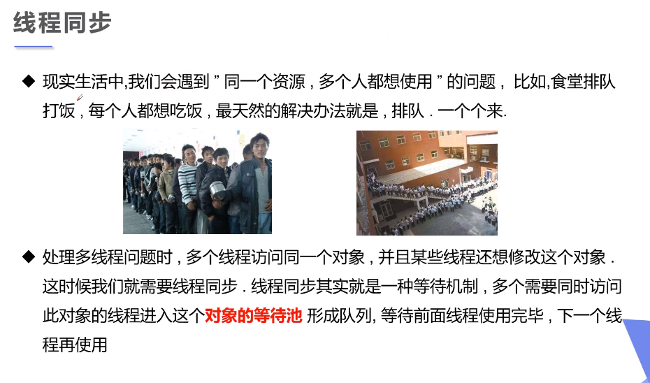


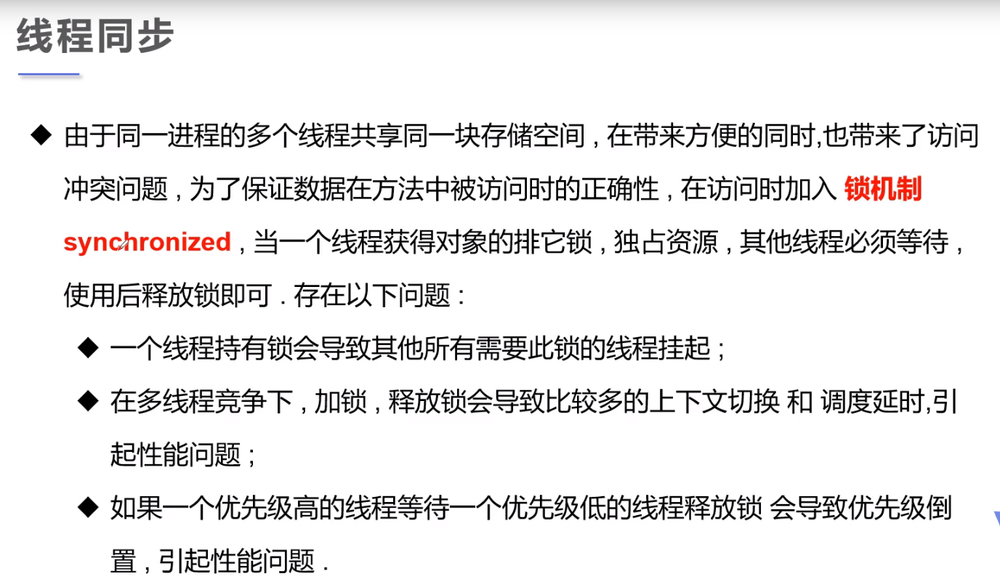


```java

class BuyTicket implements Runnable{

    //票
    private int ticketnum =10;
    boolean flag = true;

    @Override
    public void run() {
        while(flag) {
            buy();
        }

    }
    //买票的方法
    private  void buy(){
        //判断是否还有票
        if(ticketnum <= 0){
            flag = false;
            return;
        }
        try {
            //增加延时 提高出错率
            Thread.sleep(100);
        } catch (InterruptedException e) {
            e.printStackTrace();
        }
        //买票
        System.out.println(Thread.currentThread().getName()+"买到了第"+ticketnum--+"张票");
    }
}


//不安全的买票
public class UnsafeBuyTicket {
    public static void main(String[] args) {

        BuyTicket buyTicket = new BuyTicket();

        new Thread(buyTicket,"小斌").start();
        new Thread(buyTicket,"陈祥").start();
        new Thread(buyTicket,"灰灰").start();
        new Thread(buyTicket,"宋世奇").start();
    }
}

```


```java

//账户
class Accunt{
    int  money;
    String name;

    public Accunt(int money, String name) {
        this.money = money;
        this.name = name;
    }
}
//银行模拟取款
class Drawing extends Thread {
    //账户
    Accunt accunt;
    //取出的钱
    int drawingMoney;
    //现在有的钱
    int nowMoney;

    boolean flag = true;

    public Drawing(Accunt accunt, int drawingMoney, int nowMoney,String name) {
        super(name);
        this.accunt = accunt;
        this.drawingMoney = drawingMoney;
        this.nowMoney = nowMoney;
    }

    @Override
    public void run() {
        //判断有没有钱
        while (flag){
            draw();
        }
    }
    private void draw(){
        if(accunt.money - drawingMoney < 0){
            System.out.println("钱不够,取不了");
            flag = false;
            return;
        }
        try {
            Thread.sleep(1);
        } catch (InterruptedException e) {
            e.printStackTrace();
        }
        //卡内余额 = 余额-取出的钱
        accunt.money = accunt.money - drawingMoney;
        //你手里的钱
        nowMoney = nowMoney + drawingMoney;
        System.out.println(accunt.name +"余额为"+accunt.money);
        //this.getName = Thread.currentThread().getName()
        System.out.println(this.getName()+"手里的钱:"+nowMoney);
    }
}


public class UnsafeBank {
    public static void main(String[] args) {
        Accunt accunt = new Accunt(1000000,"灰灰的银行卡");

        Drawing drawing1 = new Drawing(accunt,1000,0,"小斌");
        Drawing drawing2 = new Drawing(accunt,500,50000,"灰灰");
        Drawing drawing3 = new Drawing(accunt,800,10000,"飞鸿");
        Drawing drawing4 = new Drawing(accunt,300,100000,"宋世奇");

        drawing1.start();
        drawing2.start();
        drawing3.start();
        drawing4.start();
    }
}

```

### 2.同步的方法  synchronized关键字

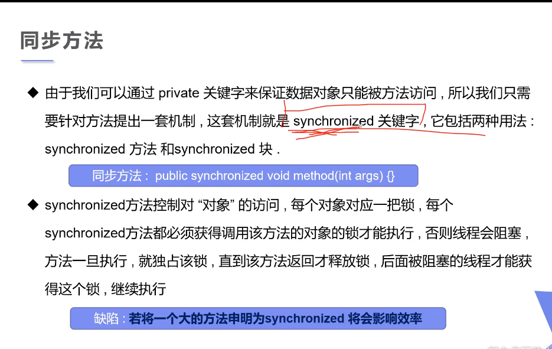

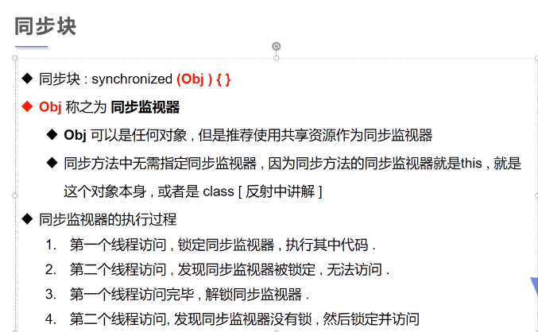

第一个在买票方法上加synchronized就行了

```java
//买票的方法
    private synchronized void buy(){
        //判断是否还有票
        if(ticketnum <= 0){
            flag = false;
            return;
        }
        try {
            //增加延时 提高出错率
            Thread.sleep(100);
        } catch (InterruptedException e) {
            e.printStackTrace();
        }
        //买票
        System.out.println(Thread.currentThread().getName()+"买到了第"+ticketnum--+"张票");
    }
```

第二个需要在方法内部 synchronized(Account.class){原来的方法体}

synchronized加载方法上 锁的是这个类的class本身

```java
private void draw(){
        synchronized (Accunt.class) {
            if (accunt.money - drawingMoney < 0) {
                System.out.println("钱不够,取不了");
                flag = false;
                return;
            }
            try {
                Thread.sleep(1);
            } catch (InterruptedException e) {
                e.printStackTrace();
            }
            //卡内余额 = 余额-取出的钱
            accunt.money = accunt.money - drawingMoney;
            //你手里的钱
            nowMoney = nowMoney + drawingMoney;
            System.out.println(accunt.name + "余额为" + accunt.money);
            //this.getName = Thread.currentThread().getName()
            System.out.println(this.getName() + "手里的钱:" + nowMoney);
        }
    }
```


### 3.死锁


```java
package syn;


public class DeadLock extends Thread {
    static  A a = new A();
    static  B b = new B();
    boolean flag ;
    public DeadLock(boolean flag) {
        this.flag = flag;
    }


    public void run(){
        if(flag)
        synchronized (a){
            System.out.println("锁定了a");
            try {
                Thread.sleep(1000);
            } catch (InterruptedException e) {
                e.printStackTrace();
            }
            synchronized (b){
                System.out.println("又锁定了b");
                System.out.println("开始执行");
            }
        }else{
            synchronized (b){
                System.out.println("锁定了b");
                try {
                    Thread.sleep(1000);
                } catch (InterruptedException e) {
                    e.printStackTrace();
                }
                synchronized (a){
                    System.out.println("又锁定了a");
                    System.out.println("开始执行");
                }
            }
        }

    }

adLock(true).start();
        new DeadLock(false).start();
    }

}

class  A{

}
class B{

}
```

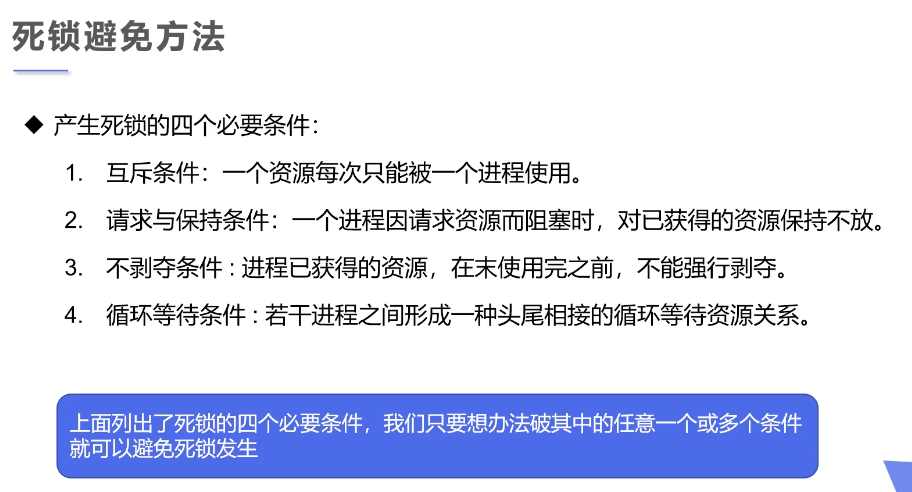

### 4.Lock(锁)

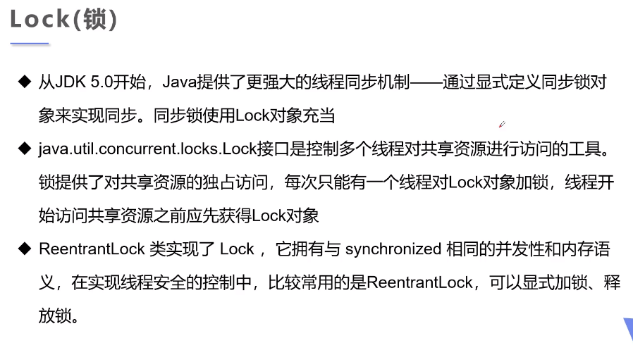

ReentrantLock 可重入锁

### 5.线程协作(通信) 生产者消费者模型

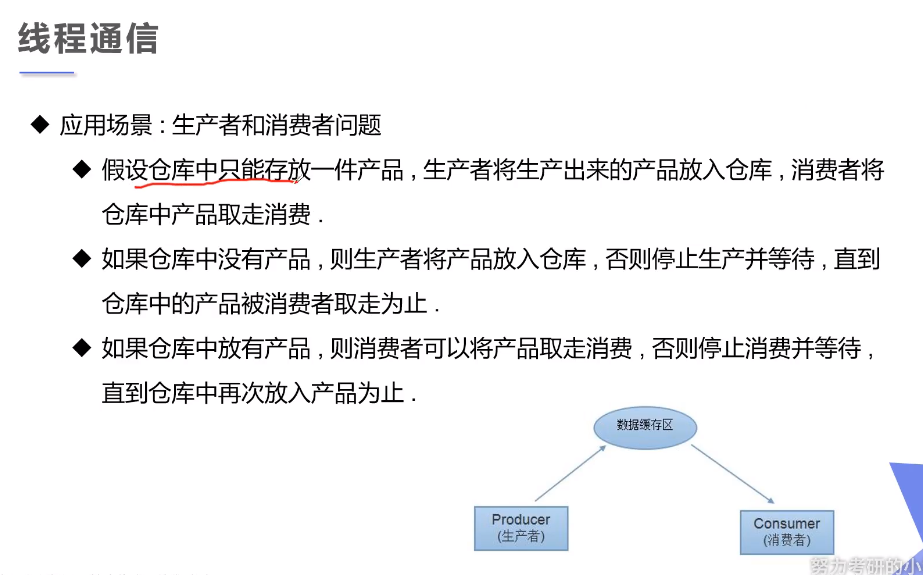

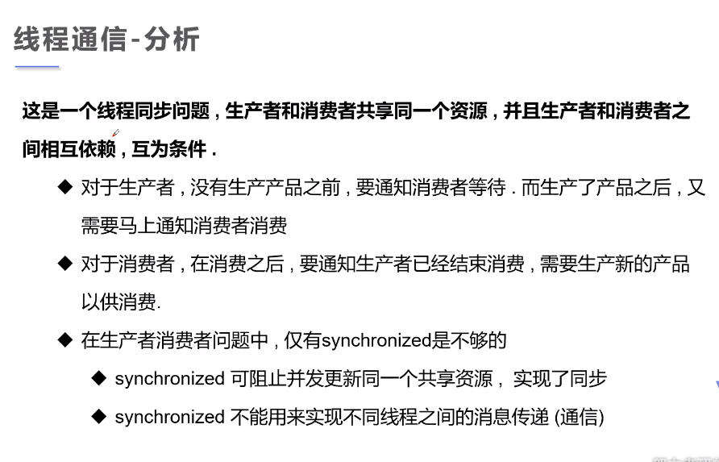

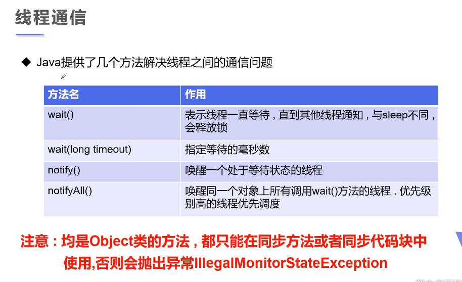

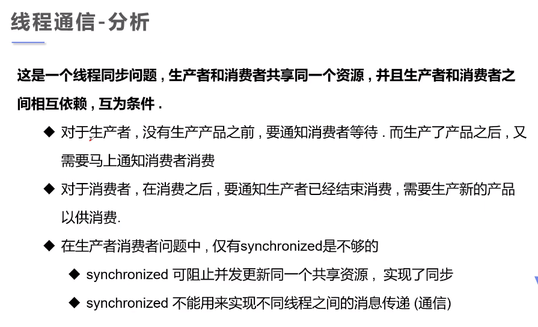

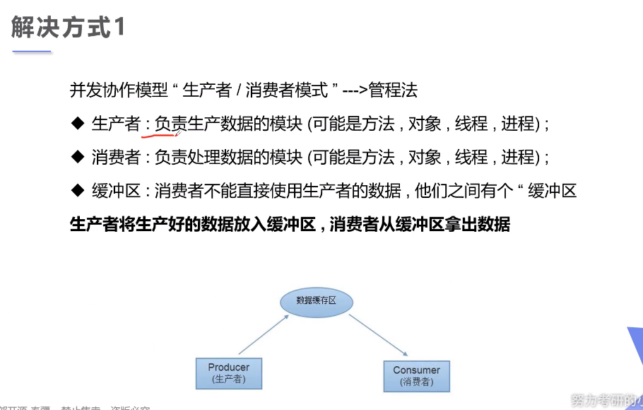


#### 管程法

```java


public class TestPC {
    public static void main(String[] args) {
        SynCache synCache = new SynCache();
        Customer customer1 = new Customer(synCache);
        Customer customer2 = new Customer(synCache);
        Producter producter = new Producter(synCache);
        producter.start();
        customer1.start();
        customer2.start();
    }
}
//消费者
class Customer extends Thread{
    SynCache synCache;

    public Customer(SynCache synCache){
        this.synCache = synCache;
    }

    @Override
    public void run() {
        for (int i = 0; i < 100; i++) {
            Chilken pop = synCache.pop();
            System.out.println("消费了第"+pop.id+"只鸡");
        }
    }
}
//生产者
class Producter extends  Thread{
    SynCache synCache;

    public Producter(SynCache synCache){
        this.synCache = synCache;
    }

    @Override
    public void run() {
        for (int i = 0; i < 100; i++) {
            System.out.println("生产了"+i+"只鸡");
            Chilken chilken = new Chilken(i);
            synCache.push(chilken);
        }
    }
}

class Chilken{
    int id;

    public Chilken() {
    }

    public Chilken(int id) {
        this.id = id;
    }
}

//缓存区
class SynCache{

    //需要一个容器大小
    Chilken[] chilkens = new Chilken[10];
    //容器计数器
    int count = 0;

    //生产者放入产品
    public synchronized void push(Chilken chilken){
        //如果容器满了就需要等待消费者消费
        if(count == chilkens.length){
            //通知消费者消费 生产等待
            try {
                this.wait();
            } catch (InterruptedException e) {
                e.printStackTrace();
            }
        }
        //如果没有满.我们就需要丢入产品
        chilkens[count]= chilken;
        count++;

        //可以通知消费者消费
        this.notifyAll();
    }


    //消费者消费产品
    public synchronized Chilken pop(){
        //如果容器没有鸡
        if(count == 0){
            //通知生产者生产 消费者等待
            try {
                this.wait();
            } catch (InterruptedException e) {
                e.printStackTrace();
            }
        }

        Chilken chilken = chilkens[--count];

        //可以通知生产者生产
        this.notifyAll();
        return chilken;
    }
}

```

#### 红绿灯法

```java
package gaoji;

public class TestPC2 {
    public static void main(String[] args) {
        TV tv = new TV();
        new Player(tv).start();
        new Watcher(tv).start();
    }
}

//生产者 演员
class Player extends Thread{
    TV tv;
    public Player(TV tv){
        this.tv = tv;
    }
    public void run(){
        for (int i = 0; i < 100 ; i++) {
            if(i%2 == 0){
                tv.play("快手");
            }else{
                tv.play("抖音");
            }
        }

    }
}

//消费者 观众
class Watcher extends Thread{
    TV tv;
    public Watcher(TV tv){
        this.tv=tv;
    }
    public void run(){
        for (int i = 0; i < 100 ; i++) {
            tv.watch();
        }
    }

}
//产品 节目
class TV {
    //演员表演,观众等待
    //观众观看,演员等待
    String voice;  //表演节目
    boolean flag = true;//标志位

    public synchronized  void play(String voice){
        if(!flag){
            try {
                this.wait();
            } catch (InterruptedException e) {
                e.printStackTrace();
            }
        }
        System.out.println("演员表演了:"+voice);
        //通知观众观看
        this.notifyAll();
        this.voice= voice;
        this.flag = !this.flag;
    }

    public synchronized void watch(){
        if(flag){
            try {
                this.wait();
            } catch (InterruptedException e) {
                e.printStackTrace();
            }
        }
        System.out.println("观看了:"+voice);
        //通知观众观看
        this.notifyAll();
        this.voice= "";
        this.flag = !this.flag;
    }
}
```

## 九.线程池 ---了解

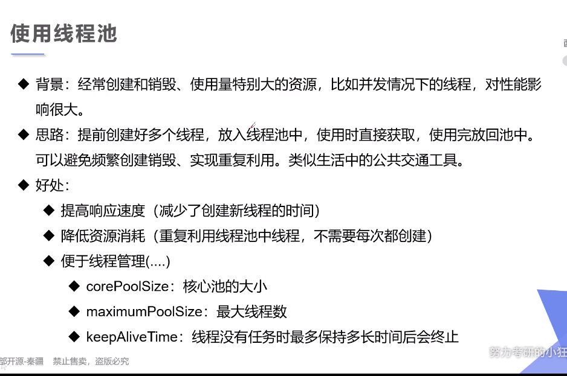

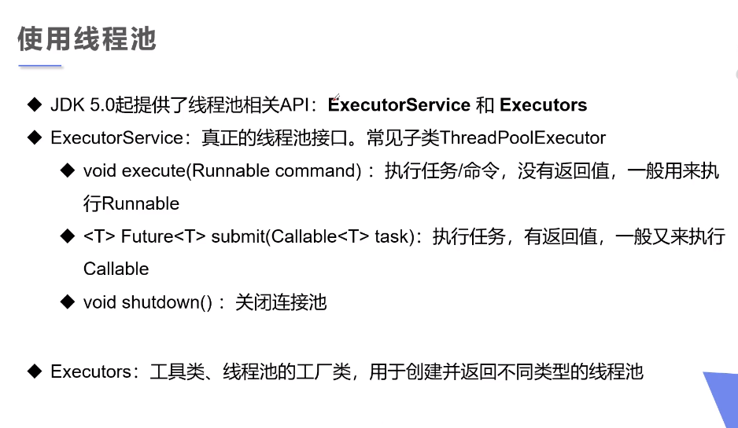

```java

import java.util.concurrent.Executor;
import java.util.concurrent.ExecutorService;
import java.util.concurrent.Executors;

//测试线程池
public class TestPool {
    public static void main(String[] args) {
        //创建线程池
        //参数 设置线程池大小
        ExecutorService service = Executors.newFixedThreadPool(5);
        service.execute(new MyThread());
        service.execute(new MyThread());
        service.execute(new MyThread());
        service.execute(new MyThread());
        service.shutdown();
    }
}

class MyThread implements Runnable{

    @Override
    public void run() {
        {
            System.out.println(Thread.currentThread().getName());
        }
    }
}
```

## 十.总结

```java


import java.util.concurrent.Callable;
import java.util.concurrent.ExecutionException;
import java.util.concurrent.FutureTask;

public class ThreadNew {
    public static void main(String[] args) throws ExecutionException, InterruptedException {
        new MyThreads().start();
        new Thread(new MyRunnable()).start();
        FutureTask<String> futureTask = new FutureTask<>(new MyCallable());
        new Thread(futureTask).start();
        String s = futureTask.get();
        System.out.println(s);
    }


}
class MyThreads extends Thread{
    @Override
    public void run() {
        System.out.println("thread线程方式");
    }
}

class MyRunnable implements Runnable{
    @Override
    public void run() {
        System.out.println("runnable线程方式");
    }
}
class MyCallable implements Callable{

    @Override
    public Object call() throws Exception {
        System.out.println("callable线程方式");
        return "yes";
    }
}package gaoji;

import com.sun.org.apache.bcel.internal.generic.NEW;

import java.util.concurrent.Callable;
import java.util.concurrent.ExecutionException;
import java.util.concurrent.FutureTask;

public class ThreadNew {
    public static void main(String[] args) throws ExecutionException, InterruptedException {
        new MyThreads().start();
        new Thread(new MyRunnable()).start();
        FutureTask<String> futureTask = new FutureTask<>(new MyCallable());
        new Thread(futureTask).start();
        String s = futureTask.get();
        System.out.println(s);
    }


}
class MyThreads extends Thread{
    @Override
    public void run() {
        System.out.println("thread线程方式");
    }
}

class MyRunnable implements Runnable{
    @Override
    public void run() {
        System.out.println("runnable线程方式");
    }
}
class MyCallable implements Callable{

    @Override
    public Object call() throws Exception {
        System.out.println("callable线程方式");
        return "yes";
    }
}
```

